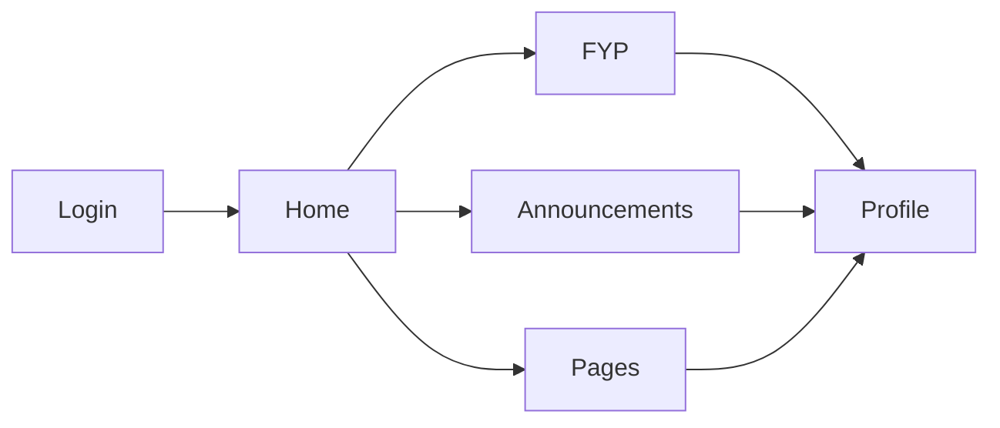

# Criteria of 3 pages

- Login or create account page
- Homepage/dashboard/timeline
- Interactive page where we could interact (like a post with comment threads etc...)

## To-Do

- [x] Authentication/Context
- [x] UI design of all pages
  - [x] Login (initial)
  - [x] Home
  - [x] Profile
- [ ] URL Params
  - [ ] User
  - [ ] Posts
  - [ ] Comments
- [x] Database Setup
  - [x] Database Schema
- [x] Testing
- [ ] Post Interactions
  - [ ] Comments
  - [ ] Likes
- [ ] Notifications

## Bugs

- [ ] Fix overflow issues
- [ ] Redundant Reads of Firebase Firestore

## App Flow

Sequence of Pages starting from Login

## Usage

1. Clone repository using `git clone https://github.com/jrsnleones/app-dev-duo1.git && cd app-dev-duo1` 
2. Install required modules using `npm install` or `yarn install`
3. Start web server using `yarn dev` or `npm run dev`

To lessen hassle, .env file was pushed with its contents intact. Normally, this would be placed in GitHub Secrets and used using GitHub Actions.

No need to change .env variables so that there would no longer be a need to create a Firebase project.

> ALL INPUTTED ARE TENTATIVE EXCEPT FOR THE CRITERIA